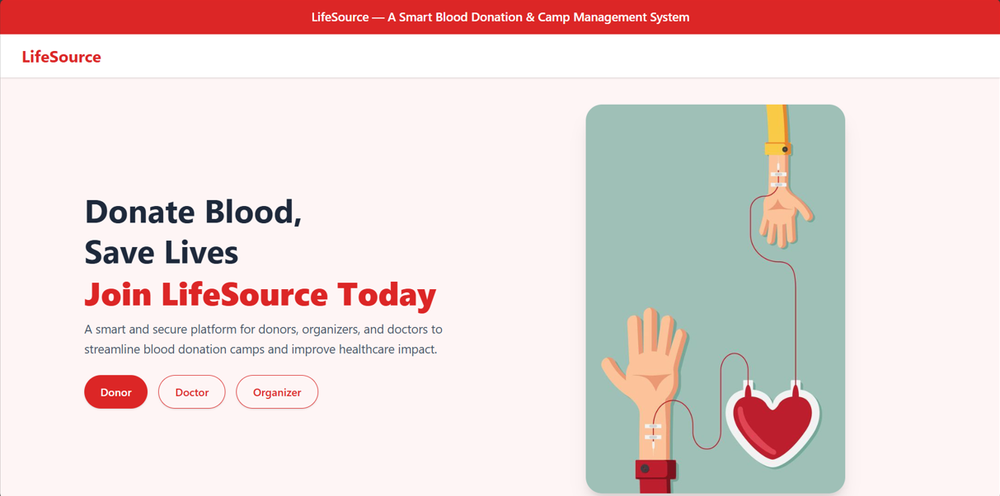
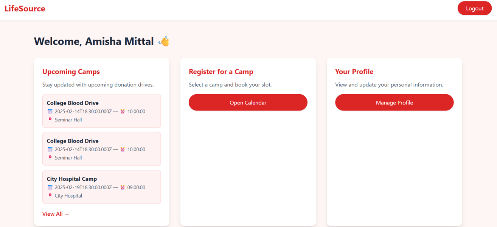
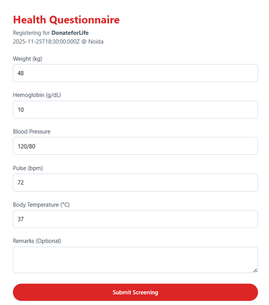
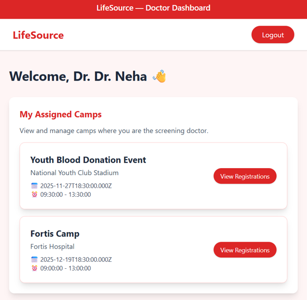
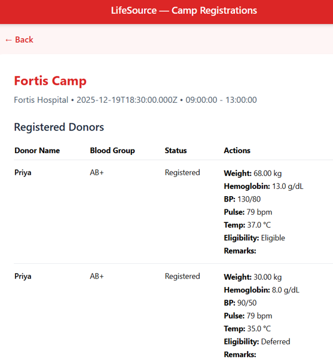
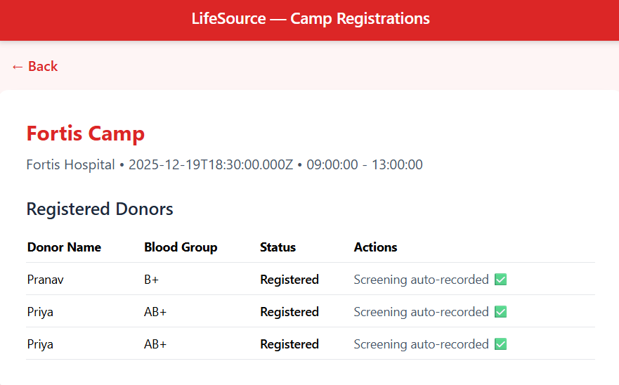

# 📌 **LifeSource — Blood Donation Camp Management System**

LifeSource is a **complete smart blood donation ecosystem** designed for colleges and communities.
It streamlines **donor registrations**, **doctor screenings**, **camp scheduling**, and **blood bank inventory management** — all using a modern, secure workflow.

This project uses:

* **Frontend:** HTML + TailwindCSS + JavaScript
* **Backend:** Node.js + Express
* **Database:** MySQL (with triggers, procedures & relationships)

---

## 🚀 **Features**

### 🧑‍🤝‍🧑 Donor Portal

* Donor registration & login
* View upcoming camps on a **calendar**
* Register for a donation camp
* Fill medical questionnaire
* View donation history
* See eligibility status

---

### 👨‍⚕️ Doctor Portal

* Doctor login & dashboard
* View assigned camps
* See all **donor screenings**
* View donor questionnaire answers (read-only)
* Perform health screening:
  * Weight
  * Hemoglobin
  * Blood pressure
  * Pulse
  * Temperature
  * Remarks
* Approve / Defer donor
* Screening saved to MySQL (using triggers & linked tables)

---

### 🎪 Organizer Portal

* Organizer registration & login
* Create blood donation camps
* Assign doctors
  
---

## 🏗 **System Architecture**

### **Backend (Node.js + Express)**

* REST API
* Route modules:

  ```
  /api/donors
  /api/doctors
  /api/organizers
  /api/camps
  /api/registrations
  /api/screening
  ```
* MySQL connection
* Stored procedures + triggers (eligibility, inventory update)

---

### **Frontend (HTML + Tailwind + JS)**

No frameworks → fast, lightweight.
Includes:

* donor-dashboard.html
* donor-calendar.html
* doctor-dashboard.html
* doctor-screening.html
* organizer-dashboard.html
* and all linked JS modules

---

### **Database (MySQL)**

#### Core Tables:

* donors
* doctors
* organizers
* camps
* camp_registrations
* pre_donation_checks
* donations

#### Automation Using:

* **Triggers**
* **Stored Procedures**
* **Foreign keys**
* **Validation constraints**

---

## 📅 **Workflow**

### **1. Donor registers for a camp**

Stored in `camp_registrations`.

### **2. Doctor sees pending donors**

Filtered by assigned camp + ‘Registered’ status.

### **3. Doctor screens donor**

Saved in `pre_donation_checks`.
`status` changes → `Screened`.

### **4. Donation occurs**

Trigger updates `inventory` automatically.

---

## 🛠 **Installation & Setup**

### 1️⃣ Clone the repository

```
git clone https://github.com/YOUR-USERNAME/blood-donation-system.git
cd blood-donation-system
```

### 2️⃣ Install backend dependencies

```
cd backend
npm install
```

### 3️⃣ Create `.env`

```
DB_HOST=localhost
DB_USER=root
DB_PASS=yourpassword
DB_NAME=blood_donation
```

### 4️⃣ Run backend

```
node server.js
```

Server runs on **[http://127.0.0.1:5001](http://127.0.0.1:5001)**

### 5️⃣ Run frontend

Simply open:

```
frontend-html/index.html
```

in your browser.

---

## 🎯 **Project Motivation**

This project solves real waste of time and inefficiency in college blood campaigns.
It makes donation transparent, safe, and well-organized.

---

## UI Screens







## ❤️ **Contributors**

* Amisha Mittal
* Harshita Saxena
* Sheen Sharma

---

